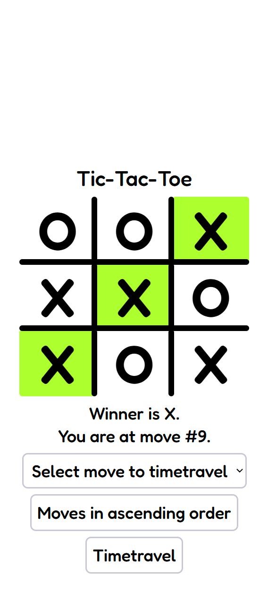
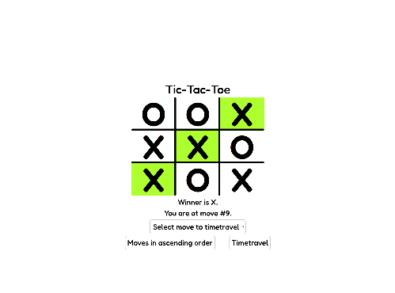

# Tic-tac-toe

## Mobile and PC demo 

    
      

## Project Background

This project originated as part of the [React Tic-Tac-Toe tutorial](https://react.dev/learn/tutorial-tic-tac-toe) completed on March 31, 2024.  
In addition to the base implementation, all the extra challenges and improvements suggested at the end of the tutorial have been integrated into this version.  

The design was further enhanced, and a new user interface component was introduced on December 25, 2024, to improve usability and visual appeal.

## Setup Instructions

Open the project root directory and then install the dependencies via `pnpm install`. Then use `pnpm start` to start a local server and follow the prompts to view the code running in a browser.

## Features/Improvements

1. For the current move only, show “You are at move #…” instead of a button.
2. Rewrite Board to use two loops to make the squares instead of hardcoding them.
3. Add a toggle button that lets you sort the moves in either ascending or descending order.
4. When someone wins, highlight the three squares that caused the win (and when no one wins, display a message about the result being a draw).
5. Display the location for each move in the format (row, col) in the move history list.

## References
*https://seanaujong.medium.com/implementing-the-react-tic-tac-toe-challenges-ed57d7ae4f67*
