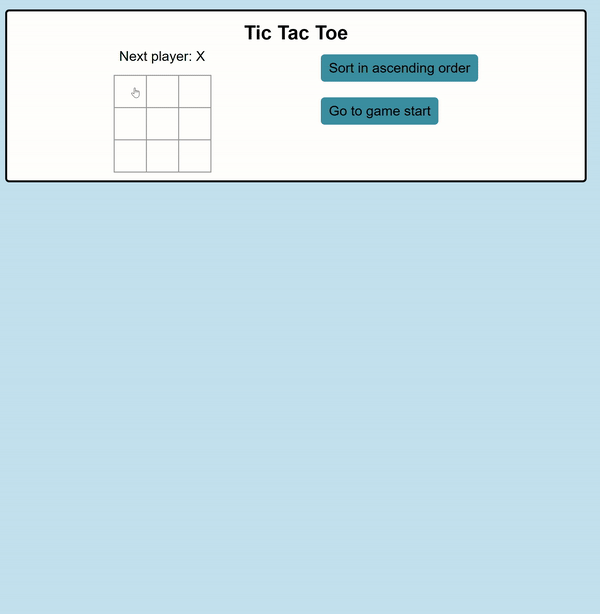

# Tic-tac-toe

## Demo 

  

## Where does this code from?

This code is from the beginner react tic-tac-toe tutorial.
The additional features and improvements mentioned at the end of the tutorial are also implemented.

## Setup

Open the project root directory and then install the dependencies via `npm install`. Then use `npm start` to start a local server and follow the prompts to view the code running in a browser.

## Features/Improvements

1. For the current move only, show “You are at move #…” instead of a button.
2. Rewrite Board to use two loops to make the squares instead of hardcoding them.
3. Add a toggle button that lets you sort the moves in either ascending or descending order.
4. When someone wins, highlight the three squares that caused the win (and when no one wins, display a message about the result being a draw).
5. Display the location for each move in the format (row, col) in the move history list.

## References
*https://seanaujong.medium.com/implementing-the-react-tic-tac-toe-challenges-ed57d7ae4f67*
